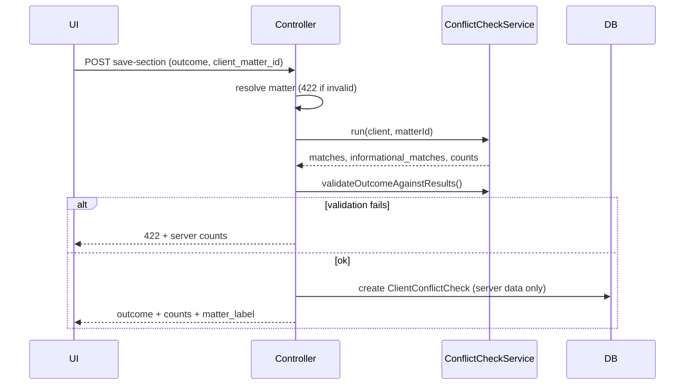

# Conflict Check — Phase 2: Audit Record Integrity & Matter Scope

**Goal:** Saved conflict checks are defensible compliance records: server-owned search results, matter-scoped, pipeline gate respects the active matter.

**Depends on:** [Phase 1](./CONFLICT_CHECK_PHASE1.md)

---

## Schema (`client_conflict_checks`)

| Column | Purpose |
|--------|---------|
| `client_matter_id` | Matter this check applies to (null = legacy client-wide) |
| `match_count` | Hard conflict count at save time |
| `informational_count` | Informational note count at save time |
| `informational_matches` | JSON snapshot of informational rows |
| `parties_snapshot_at` | Last opposing-party row update for the matter |
| `search_hash` | `sha256` of normalized `search_terms` at run/save |

Migration: `database/migrations/2026_08_01_100000_add_matter_scope_to_client_conflict_checks.php`

---

## Save flow (server-authoritative)



- Client-supplied `search_terms` / `matches` are **ignored** (tampering logged if mismatch).
- **Clear** rejected when `match_count > 0` unless `force_clear=1` + note ≥ 20 chars.
- **Waived** with hard matches requires outcome notes ≥ 10 chars (plus existing consent rules).
- **Informational-only** allows **Clear** (`match_count === 0`).

---

## Pipeline gate (leads)

When moving to `engaged` or `retained`:

1. Requires a **Clear** or **Waived** check for the **active matter** (`client_matter_id` from request, or latest active matter fallback).
2. Legacy checks with `client_matter_id = null` still count (grace period).
3. Latest outcome for that matter scope must not be `pending` or `conflict_found`.

**Clear on Matter A does not satisfy Matter B** (unless legacy null-matter row exists).

---

## UI changes

- Outcome save sends `client_matter_id` only (no matches JSON).
- Client-side Clear confirm removed — server validates.
- History shows matter ref + conflict/informational counts.
- Lead pipeline save sends `client_matter_id` from card data attribute.

---

## Loading checks on client detail

Latest check + last 5 history rows filtered with `ClientConflictCheck::forActiveMatter($activeClientMatterId)`.

---

## Tests

```bash
vendor/bin/phpunit tests/Feature/ConflictCheckPhase2Test.php
```

| Test | Asserts |
|------|---------|
| `cannot_save_clear_when_server_finds_hard_matches` | 422, no DB row |
| `stripped_client_matches_are_ignored_server_rejects_clear` | Tampered `matches: []` still rejected |
| `informational_only_allows_clear_outcome_save` | Clear saved with `informational_count = 1` |
| `clear_on_matter_a_does_not_satisfy_pipeline_for_matter_b` | `conflict_warning` set |
| `clear_on_matter_a_satisfies_pipeline_when_same_matter_active` | No warning |
| `outcome_save_persists_server_search_metadata` | `search_hash`, `search_terms` stored |

---

## Activity log format

- **Run:** `Matter SUB-123 — Automated search completed — 0 conflicts · 1 informational note(s)`
- **Save:** `Outcome: Clear — no conflict found · Matter SUB-123 · 0 conflicts · 1 informational`

---

## See also

- [Phase 0 baseline](./CONFLICT_CHECK_PHASE0.md)
- [Phase 1 false-positive fixes](./CONFLICT_CHECK_PHASE1.md)
- [Phase 3 search coverage](./CONFLICT_CHECK_PHASE3.md)
- [Phase 4B staleness enforcement](./CONFLICT_CHECK_PHASE4B.md)
