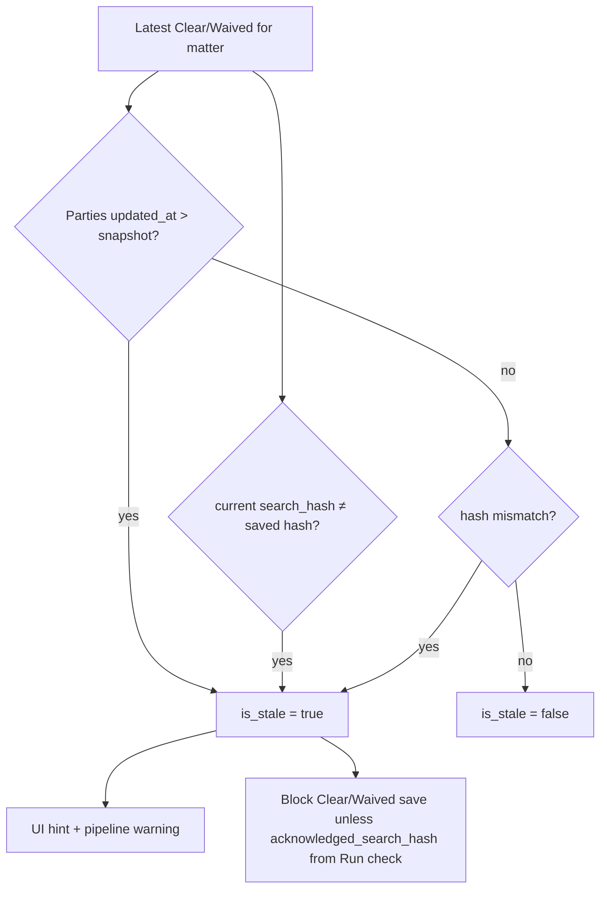

# Conflict Check — Phase 4B: Staleness Enforcement

**Goal:** A Clear/Waived outcome is only valid for the current party set and client search terms. If parties or subject details change after a check, staff must re-run before saving Clear/Waived or moving the pipeline to engaged/retained.

**Depends on:** [Phase 1](./CONFLICT_CHECK_PHASE1.md), [Phase 2](./CONFLICT_CHECK_PHASE2.md), [Phase 3](./CONFLICT_CHECK_PHASE3.md)

---

## Staleness rules



| Trigger | Detection |
|---------|-----------|
| **Parties changed** | `max(updated_at)` on `client_matter_opposing_parties` (fallback: `client_conflict_parties`) > `parties_snapshot_at` on last Clear/Waived |
| **Subject details changed** | `buildSearchHash(current terms)` ≠ `search_hash` on last Clear/Waived |
| **No prior Clear/Waived** | Not stale (first check allowed) |

Reference check is always the **latest Clear or Waived** for the active matter scope (`ClientConflictCheck::forActiveMatter()`).

---

## Service

`app/Services/ConflictCheckStalenessService.php`

| Method | Use |
|--------|-----|
| `evaluateStaleness()` | Page load, pipeline gate, run-check response |
| `evaluateAgainstPreviousCheck()` | Outcome save — accepts `acknowledged_search_hash` from Run check |
| `partiesUpdatedAtForMatter()` | Shared party timestamp helper |
| `findLatestClearOrWaived()` | Reference record lookup |

`ConflictCheckService::buildSearchContext()` builds current `search_hash` without executing a full search.

---

## Outcome save (server)

1. Server re-runs search (Phase 2 — unchanged).
2. For **Clear** / **Waived**: `evaluateAgainstPreviousCheck()` compares current state to last saved Clear/Waived.
3. If stale and `acknowledged_search_hash` does not match current hash → **422** `error_type: stale`.
4. On success, new row gets fresh `parties_snapshot_at` and `search_hash`.

**Run check** returns `search_hash` for the UI to send as `acknowledged_search_hash` on save.

---

## Pipeline gate

When moving to `engaged` / `retained`:

1. Existing rule: must have a Clear/Waived for the matter.
2. **New:** latest Clear/Waived must not be stale vs current parties + search hash.
3. Existing rule: latest outcome must not be `pending` / `conflict_found` (unchanged).

---

## UI (`conflict-parties-card`)

- `#cpStaleHint` shown on load when `$conflictCheckStaleness['is_stale']`
- After **Run check**: stores `search_hash`, hides hint, enables Clear/Waived save
- **Save outcome** sends `acknowledged_search_hash` when a run occurred in-session
- **422 stale**: toast + show hint
- Clear/Waived save button disabled when stale until Run check succeeds

---

## Tests

```bash
vendor/bin/phpunit tests/Feature/ConflictCheckPhase4bTest.php
```

Full regression:

```bash
vendor/bin/phpunit tests/Feature/ConflictCheckPhase0Test.php tests/Feature/ConflictCheckPhase1Test.php tests/Feature/ConflictCheckPhase2Test.php tests/Feature/ConflictCheckPhase3Test.php tests/Feature/ConflictCheckPhase4bTest.php
```

---

## QA checklist

- [ ] Save parties → Run check → Save Clear → OK
- [ ] Change a party → Save parties → try Save Clear without re-run → 422 stale
- [ ] Change party → Run check → Save Clear → OK
- [ ] Clear on matter → change parties → move pipeline to engaged → warning
- [ ] Re-run + save Clear → engaged → no warning
- [ ] Hint visible on page load when stale

---

## See also

- [Phase 2 audit integrity](./CONFLICT_CHECK_PHASE2.md) — `parties_snapshot_at`, `search_hash` columns
- [Phase 3 search coverage](./CONFLICT_CHECK_PHASE3.md)

**Next:** [Phase 4A](./CONFLICT_CHECK_PHASE0.md) party upsert (preserve aliases, DOB, extra contacts on re-save).
